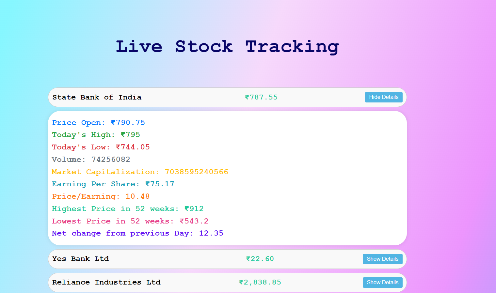

# Stock Price Tracker

This project is a React application that tracks and displays live stock prices for various companies. It fetches data from Google Finance and updates prices periodically. The project also includes proxy setup to handle CORS issues.

## Features

- Display live stock prices using data fetched from Google Finance Website.
- Periodically updates stock prices every 10 seconds.
- Shows additional details for each stock on expansion.
- Uses Redux for state management.
- Handles CORS issues with a proxy setup.

## Installation

### Prerequisites

Ensure you have the following installed:

- Node.js
- npm (Node Package Manager)

### Libraries Used

- axios: For making HTTP requests.
- cheerio: For parsing and manipulating HTML.
- http-proxy-middleware: For setting up a proxy to handle CORS issues.
- react-redux: For integrating React with Redux.
- redux: For state management in the application.

### Steps

1. Clone the repository:

   ```bash
   git clone https://github.com/your-username/Stock-Price.git
   cd stock-price-tracker

2. Install Dependencies
   ```bash
   npm install axios cheerio http-proxy-middleware react-redux redux
   
3. Set up the proxy:
    - Create a setupProxy.js file in the src directory

4. Start React Application
   ```bash
   npm start

## Project Structure

The project structure includes the following components:

- **src/components**: This directory contains React components.
  - **StockPrice.js**: The main component responsible for displaying stock prices.
  - **StockRow.js**: A component to display individual stock details.
  - **LivePrice.js**: Another component for handling live price updates.

- **src/redux**: This directory contains Redux-related files.
  - **actions.js**: Defines actions for fetching stock prices.
  - **reducers.js**: Defines reducers for updating the state.
  - **store.js**: Configures the Redux store.

- **src/setupProxy.js**: Contains the proxy configuration to handle CORS issues.

- **src/App.js**: The main entry point of the React application.

## Usage
- The application fetches live stock prices from Google Finance.
- Click on **"Show Details"** to expand and view additional details of a stock.
- GoogleFinance function is used to retrieve more details from Google Sheets API
- The stock prices are updated every 10 seconds automatically.

## More Details
- [Google Sheet](https://docs.google.com/spreadsheets/d/1WWX7KrUcnqNPxHpnxlIhrVFj3DDrRbsTc-AIDChfdD4/edit?usp=sharing)
- 
